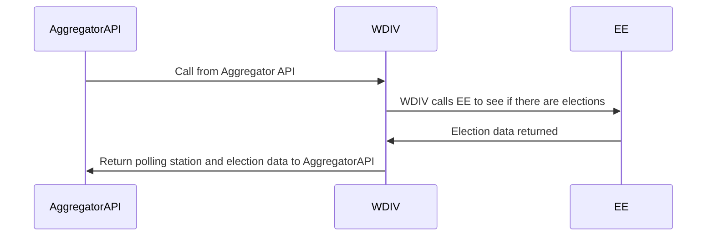

[](https://circleci.com/gh/DemocracyClub/UK-Polling-Stations) [](https://coveralls.io/github/DemocracyClub/UK-Polling-Stations) 

# UK-Polling-Stations

This is a work in progress project that needs help in a number of ways:

1. Importing the data we have collected from councils ([See Below](https://github.com/DemocracyClub/UK-Polling-Stations#importing-the-data-we-have-from-councils))
2. If you are a developer (python, django, frontend, etc) or designer, we need help making the site itself.
3. If you are interested in helping us gather this data, or if you know a lot about the strange world of the UK geographic system.

If you are interested in helping out in any way at all, please contact sym@democracyclub.org.uk

## Getting Started

### Python
UK-Polling-Stations requires python 3.10

### Install system dependencies
UK-Polling-Stations requires Python 3.10, Postgres, PostGIS, libgeos, GDAL, Node JS and NPM.

On Mac OSX, run:
```
brew install postgresql
brew install postgis
brew install geos
brew install gdal
brew install node
```

From a clean install of Ubuntu 22.04 (Bionic):
```
sudo apt-get install postgresql-14 postgresql-server-dev-all python-psycopg2 python3-dev postgis postgresql-14-postgis-3 libxml2-dev libxslt1-dev nodejs npm libtidy-dev

sudo npm install -g npm@latest-6
```

For other linux distributions, see [here](https://docs.djangoproject.com/en/2.2/ref/contrib/gis/install/geolibs/) for details on installing geospatial libraries for use with Django.


### Install python dependencies

- Local Dev without CDK libs
```
pip install -r requirements/base.txt -r requirements/testing.txt -r requirements/local.txt -r cdk/lambdas/wdiv-s3-trigger/requirements.txt -r cdk/lambdas/wdiv-s3-trigger/requirements/testing.txt
```

- Local Dev with CDK libs
```
pip install -r requirements/base.txt -r requirements/testing.txt -r requirements/local.txt -r requirements/cdk.txt -r cdk/lambdas/wdiv-s3-trigger/requirements.txt -r cdk/lambdas/wdiv-s3-trigger/requirements/testing.txt
```

- Just Running Tests
```
pip install -r requirements/base.txt -r requirements/testing.txt -r cdk/lambdas/wdiv-s3-trigger/requirements.txt -r cdk/lambdas/wdiv-s3-trigger/requirements/testing.txt
```

- Update requirements
Bump version in relevant requirements file, e.g. ```base.in``` then run ```python -m invoke requirements --upgrade```.

### Install front-end dependencies
```
npm install
```

### Install testing python dependencies
```
pip install -r requirements/testing.txt
```

### Install testing system dependencies
We have a suite of end-to-end integration tests. We use [Playwright](https://playwright.dev/python/)
with `pytest` to run these.

To set up playwright, after running `pip install -r requirements/testing.txt`,
run `playwright install`. This will download the browser biniaries required
for your system.

The Playwright tests will run in a headless browser as part of a normal `pytest` run.
You may want to run the Playwright suite in headed mode for debugging purposes. To do that, run the following:

`pytest polling_stations/apps/data_finder/tests/playwright/ --headed`

### Create local config
```
cp polling_stations/settings/local.example.py polling_stations/settings/local.py
```

### Create database
```
sudo -u postgres createdb polling_stations
sudo -u postgres createuser dc -P -s
sudo -u postgres psql polling_stations
psql (9.3.6)
Type "help" for help.

polling_stations=# CREATE EXTENSION postgis;
CREATE EXTENSION
polling_stations=#
```

### Update local.py
Be sure that your database user name matches
To check, run:
`psql postgres`
then:
`\l`
### Run migrations
```
python manage.py migrate
```

### Import initial data

#### Import ONSPD

For development purposes, you can use the ONSPD for geocoding. Grab the latest release from https://geoportal.statistics.gov.uk/search?collection=Dataset&sort=-modified&tags=PRD_ONSPD unzip the data and import it using:

```
python manage.py import_onspd /path/to/data
```

N.B. Path is to data _directory_ which contains the csv, not the csv itself.

#### Import Councils

```
python manage.py import_councils --import-old-boundaries
```

#### Import some Polling District/Station data

For development purposes, you will need to seed your database with some data.
We depend on Ordnance Survey Addressbase Plus, which is not publicly available.
To allow open source contributions we have prepared the sample data Ordnance Survey
provide (https://www.ordnancesurvey.co.uk/business-government/products/addressbase-plus#sample-data)
ready for import, and some sample import scripts for testing.

To prepare your database run the following commands:

```
./manage.py import_cleaned_addresses test_data/addressbase/
./manage.py create_uprn_council_lookup
./manage.py import_uprn_council_lookup uprn-to-councils.csv
```

You can clean up the look up with:

```
rm uprn-to-councils.csv
```

And finally you can import some dummy data with:

```
./manage.py import_fake_teignbridge
./manage.py import_fake_exeter
```

## Importing the data we have from councils

Each council that has unimported data has a Github Issue with the [Data Import](https://github.com/DemocracyClub/UK-Polling-Stations/issues?q=is%3Aissue+is%3Aopen+label%3A%22Data+Import%22) label.

We make a Django `manage.py` command in the data_importers app for each council which imports the raw data.
If you are interested in helping the project by writing an import script, see the issues tagged [recommended for beginners](https://github.com/DemocracyClub/UK-Polling-Stations/issues?q=is%3Aissue+is%3Aopen+label%3A%22recommended+for+beginners%22) for more info.

## Welsh Language translations
```
django-admin makemessages -l cy --ignore='env*'
./manage.py compilemessages
```

## Install git hooks

If you like you can use the commit hooks defined in `.pre-commit-config.yaml`. Run `pre-commit install && pre-commit install -t pre-push`.

## Custom council domains
If a user requests access to the council uploader using a custom domain, the domain should be added to the [`CUSTOM_DOMAINS` setting](https://github.com/DemocracyClub/UK-Polling-Stations/blob/master/polling_stations/settings/constants/uploads.py).
To remove a custom domain, follow these steps:
1) Delete the entry from the CUSTOM_DOMAIN list in `polling_stations/settings/constants/uploads.py`
2) In the admin panel, delete the UserCouncil object from the bottom of the Council profile page

## Election season
As part of preparations for upcoming elections, `NEXT_CHARISMATIC_ELECTION_DATES` will need to be updated in
`settings/constants/elections.py`. This var takes a ["YYYY-MM-DD",] format.

To show messaging about the 2022 GB voter ID legislation, update `SHOW_GB_ID_MESSAGING` to `True` in `settings/constants/elections.py`.

## API

This project has an API, however it's not designed for public consumption.

To authenticate against the API you need to pass a token in the `auth_token` GET parameter.

The main API endpoints are `postcode` and `address`. These endpoints return polling station information for the given location.

In turn, they request the EveryElection API.


This workflow is the same for the `postcode` and `address` endpoints.

The documentation for the AggregatorAPI should explain the main concepts for this API.

### API development documentation

We use [`drf-spectacular`](https://github.com/tfranzel/drf-spectacular) to document the API.

The documentation is inline with the code, meaning that comments and annotations should be enough
in most case to understand what's going on.  `drf-spectacular` comes with some views for
`Redoc` and `Swagger`. To enable these, set `ENABLE_API_DOCS=True` in `local.py` and visit `http://localhost:8000/api/swagger/` or `http://localhost:8000/api/docs/`.

## Adding tokens

There are two types of token:

* `READ_ONLY_API_AUTH_TOKENS`
* `SUPERUSER_API_AUTH_TOKENS`

Both are lists that are defined in settings. To add a token, add a string to the correct list, or set environment variables as comma seperated values.

Superuser API tokens are designed for the Trigger function that posts information about newly updated files back to the uploads app.

Read only tokens are for the workflow outlined above.
